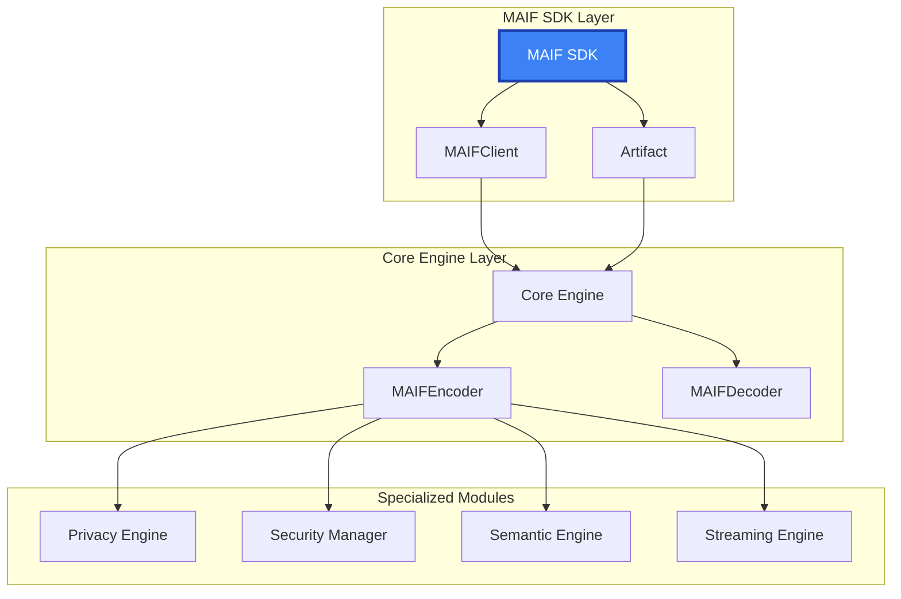

# API Reference

MAIF provides a comprehensive API for building AI agents with built-in privacy, security, and semantic understanding. The API is designed for both simplicity and power, supporting everything from basic agent memory to advanced multi-modal processing.

## API Architecture Overview

MAIF's API is organized into logical modules that build upon each other:



## Quick Start Reference

### Essential Imports

```python
# Simple API (recommended for most users)
from maif_api import (
    create_maif,            # Create a new MAIF instance
    load_maif,              # Load an existing MAIF file
    MAIF                    # Main MAIF class
)

# Core components (for advanced use cases)
from maif import (
    MAIFEncoder,            # Low-level encoder for MAIF binary format
    MAIFDecoder,            # Low-level decoder for MAIF binary format
    PrivacyEngine,          # Privacy features: encryption, anonymization
    PrivacyPolicy,          # Privacy policy configuration
    PrivacyLevel,           # Privacy level enum
    EncryptionMode          # Encryption mode enum
)

# Security components
from maif.security import (
    MAIFSigner,             # Digital signature creation
    MAIFVerifier,           # Signature verification
    SecurityManager,        # Security operations manager
    AccessController        # Access control management
)

# Novel algorithms (if available)
from maif.semantic_optimized import (
    AdaptiveCrossModalAttention,      # ACAM algorithm
    HierarchicalSemanticCompression,  # HSC algorithm
    CryptographicSemanticBinding      # CSB algorithm
)
```

### Basic Usage Pattern

```python
from maif_api import create_maif, load_maif

# 1. Create a MAIF instance
maif = create_maif("my-agent")

# 2. Add content
maif.add_text("Important information to remember", title="Note")

# 3. Save to file with signature
maif.save("memory.maif", sign=True)

# 4. Load an existing file
loaded = load_maif("memory.maif")

# 5. Read content
for content in loaded.get_content_list():
    print(f"Title: {content.get('title')}, Text: {content.get('text', '')[:50]}")
```

### Quick Operations

For simple one-off operations:

```python
from maif_api import create_maif, load_maif

# Quick write
maif = create_maif("quick-agent")
maif.add_text("Hello World")
maif.save("data.maif")

# Quick read
loaded = load_maif("data.maif")
print(loaded.get_content_list())
```

## API Modules

### Core API

The foundation of MAIF operations, providing the essential building blocks for creating and managing agents and artifacts.

- **[MAIFClient](/api/core/client)** - Native MAIF file operations
- **[Artifact](/api/core/artifact)** - Container for agent data and memory
- **[Encoder/Decoder](/api/core/encoder-decoder)** - Low-level binary operations

```python
from maif_api import create_maif, MAIF
from maif import MAIFEncoder, MAIFDecoder
```

### Privacy & Security API

Tools for building secure and privacy-preserving AI systems.

- **[Privacy Engine](/api/privacy/engine)** - Encryption, anonymization, differential privacy
- **[Security Manager](/api/security/index)** - Digital signatures, tamper detection
- **[Access Control](/api/security/access-control)** - Granular permissions

```python
from maif import PrivacyEngine, PrivacyPolicy, PrivacyLevel
from maif.security import SecurityManager, MAIFSigner, AccessController
```

## Configuration Options

### MAIF Configuration

```python
from maif_api import create_maif

# Create MAIF instance with options
maif = create_maif(
    agent_id="my-agent",
    enable_privacy=True  # Enable privacy features
)

# Add content with privacy options
maif.add_text(
    "Sensitive information",
    encrypt=True,      # Enable encryption
    anonymize=True     # Remove PII automatically
)

# Save with digital signature
maif.save("secure.maif", sign=True)
```

### Privacy Policies

```python
from maif import PrivacyPolicy, PrivacyLevel, EncryptionMode

# Create a custom policy
policy = PrivacyPolicy(
    privacy_level=PrivacyLevel.CONFIDENTIAL,
    encryption_mode=EncryptionMode.AES_GCM,
    anonymization_required=True,
    audit_required=True,
    retention_period=365  # days
)
```

### Privacy Levels

```python
from maif import PrivacyLevel

# Available privacy levels
PrivacyLevel.PUBLIC       # No encryption, public access
PrivacyLevel.INTERNAL     # Internal use only
PrivacyLevel.CONFIDENTIAL # Encrypted, restricted access
PrivacyLevel.RESTRICTED   # Maximum protection
```

## Error Handling

MAIF operations may raise standard Python exceptions:

```python
try:
    from maif_api import load_maif
    artifact = load_maif("data.maif")
    
    # Verify integrity
    if not artifact.verify_integrity():
        print("Warning: Data may have been modified")
        
except FileNotFoundError:
    print("MAIF file not found")
except Exception as e:
    print(f"Error loading MAIF: {e}")
```

## Content Types

MAIF supports multiple content types through its block system:

- **TEXT** - Text content (UTF-8)
- **IMAGE** - Image data
- **VIDEO** - Video data
- **AUDIO** - Audio data
- **EMBEDDING** - Vector embeddings
- **METADATA** - Metadata blocks
- **MULTIMODAL** - Combined content types

## Primary API

The recommended API for most users:

```python
from maif_api import create_maif, load_maif

# Create a new MAIF file
maif = create_maif("my-agent")
maif.add_text("Hello, World!")
maif.save("data.maif", sign=True)

# Load an existing file
loaded = load_maif("data.maif")
content = loaded.get_content_list()
for item in content:
    print(item)
```

## Environment Variables

Configure MAIF behavior through environment variables:

```bash
# Performance
export MAIF_ENABLE_MMAP=true
export MAIF_BUFFER_SIZE=65536

# Logging
export MAIF_LOG_LEVEL=INFO

# AWS Integration (optional)
export AWS_REGION=us-east-1
export MAIF_USE_AWS=false
```

---

## Next Steps

Choose the API module that matches your needs:

::: info Module Guide

**New Users**: Start with **[MAIFClient](/api/core/client)** and **[Artifact](/api/core/artifact)**

**Privacy/Security Focus**: Explore **[Privacy Engine](/api/privacy/engine)** and **[Security API](/api/security/index)**

**Low-Level Operations**: See **[Encoder/Decoder](/api/core/encoder-decoder)**

:::

---

*The MAIF API is designed to grow with your needs - start simple and add advanced features as required.*
