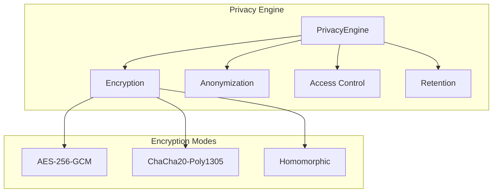

# Privacy Engine

The `PrivacyEngine` provides comprehensive privacy-by-design features for MAIF, including encryption, anonymization, access control, and data retention.

## Overview



## Quick Start

```python
from maif.privacy import PrivacyEngine, PrivacyPolicy, PrivacyLevel, EncryptionMode

# Create engine
engine = PrivacyEngine()

# Encrypt data
encrypted, metadata = engine.encrypt_data(b"Sensitive data", "block-123")

# Anonymize text
anonymized = engine.anonymize_data("John Smith lives at 123 Main St", "context-1")

# Set access rules
from maif.privacy import AccessRule
rule = AccessRule(
    subject="user-1",
    resource="block-123",
    permissions=["read"]
)
engine.add_access_rule(rule)
```

## PrivacyEngine

The core privacy engine class.

### Constructor

```python
class PrivacyEngine:
    def __init__(self):
        """Initialize privacy engine with master key and empty policies."""
```

### Properties

| Property | Type | Description |
|----------|------|-------------|
| `access_rules` | `List[AccessRule]` | Access control rules |
| `privacy_policies` | `Dict[str, PrivacyPolicy]` | Block ID to policy mapping |
| `encryption_keys` | `Dict[str, bytes]` | Block ID to encryption key mapping |
| `anonymization_maps` | `Dict[str, Dict]` | Context to pseudonym mapping |
| `retention_policies` | `Dict[str, int]` | Block ID to retention days |

## Encryption

### encrypt_data

Encrypt data with specified mode.

```python
def encrypt_data(
    self,
    data: bytes,
    block_id: str,
    encryption_mode: EncryptionMode = EncryptionMode.AES_GCM,
    use_batch_key: bool = True
) -> Tuple[bytes, Dict[str, Any]]:
    """
    Encrypt data.

    Args:
        data: Data to encrypt
        block_id: Unique block identifier
        encryption_mode: Encryption algorithm to use
        use_batch_key: Use shared key for batch operations (faster)

    Returns:
        Tuple of (encrypted_data, metadata)

    Raises:
        ValueError: If data is empty or block_id is missing
    """
```

**Example:**

```python
engine = PrivacyEngine()

# Encrypt with AES-GCM (default)
encrypted, meta = engine.encrypt_data(b"Secret", "block-1")
print(f"Algorithm: {meta['algorithm']}")  # AES-GCM

# Encrypt with ChaCha20
encrypted, meta = engine.encrypt_data(
    b"Secret",
    "block-2",
    encryption_mode=EncryptionMode.CHACHA20_POLY1305
)
```

### decrypt_data

Decrypt previously encrypted data.

```python
def decrypt_data(
    self,
    encrypted_data: bytes,
    block_id: str,
    metadata: Dict[str, Any] = None
) -> bytes:
    """
    Decrypt data.

    Args:
        encrypted_data: Encrypted data
        block_id: Block identifier (must match encryption)
        metadata: Encryption metadata from encrypt_data

    Returns:
        Decrypted data

    Raises:
        ValueError: If no key found for block_id
    """
```

**Example:**

```python
# Encrypt
encrypted, meta = engine.encrypt_data(b"Secret message", "block-1")

# Decrypt
decrypted = engine.decrypt_data(encrypted, "block-1", meta)
assert decrypted == b"Secret message"
```

### Batch Encryption

For high-throughput scenarios:

```python
# Sequential batch
data_blocks = [
    (b"data1", "block-1"),
    (b"data2", "block-2"),
    (b"data3", "block-3"),
]

results = engine.encrypt_batch(data_blocks)
for encrypted, meta in results:
    print(f"Encrypted: {len(encrypted)} bytes")

# Parallel batch (faster for large datasets)
results = engine.encrypt_batch_parallel(data_blocks)
```

## Encryption Modes

```python
from maif.privacy import EncryptionMode

EncryptionMode.NONE              # No encryption
EncryptionMode.AES_GCM           # AES-256-GCM (default, fastest)
EncryptionMode.CHACHA20_POLY1305 # ChaCha20-Poly1305 (mobile-friendly)
EncryptionMode.HOMOMORPHIC       # Paillier homomorphic (compute on encrypted)
```

| Mode | Speed | Use Case |
|------|-------|----------|
| AES_GCM | Fastest | General purpose, hardware accelerated |
| CHACHA20_POLY1305 | Fast | Mobile, no AES hardware |
| HOMOMORPHIC | Slow | Compute on encrypted data |

## Anonymization

### anonymize_data

Anonymize sensitive data while preserving utility.

```python
def anonymize_data(self, data: str, context: str) -> str:
    """
    Anonymize sensitive data.

    Args:
        data: Text to anonymize
        context: Context key for consistent pseudonyms

    Returns:
        Anonymized text with pseudonyms
    """
```

**Example:**

```python
engine = PrivacyEngine()

# Anonymize text
text = "John Smith lives at 123 Main St. Email: john@example.com"
anon = engine.anonymize_data(text, "customer-data")
print(anon)
# "ANON_NAME_0000 lives at 123 Main St. Email: ANON_EMAIL_0001"

# Same context = consistent pseudonyms
text2 = "Contact John Smith for details"
anon2 = engine.anonymize_data(text2, "customer-data")
# "Contact ANON_NAME_0000 for details" (same pseudonym)
```

### Detected Patterns

The anonymizer detects:
- **Email addresses**: `john@example.com` → `ANON_EMAIL_0001`
- **SSN**: `123-45-6789` → `ANON_SSN_0002`
- **Phone numbers**: `555-123-4567` → `ANON_PHONE_0003`
- **Credit cards**: `1234-5678-9012-3456` → `ANON_CREDIT_CARD_0004`
- **Names**: `John Smith` → `ANON_NAME_0000`

## Access Control

### add_access_rule

Add an access control rule.

```python
from maif.privacy import AccessRule

rule = AccessRule(
    subject="user-123",           # User/agent ID
    resource="block-*",           # Resource pattern (supports wildcards)
    permissions=["read", "write"], # List of permissions
    conditions={},                 # Additional conditions
    expiry=time.time() + 86400    # Optional expiry timestamp
)

engine.add_access_rule(rule)
```

### check_access

Check if a subject has permission.

```python
def check_access(
    self,
    subject: str,
    resource: str,
    permission: str
) -> bool:
    """
    Check access permission.

    Args:
        subject: User/agent identifier
        resource: Resource identifier
        permission: Required permission

    Returns:
        True if access is granted
    """
```

**Example:**

```python
from maif.privacy import AccessRule

engine = PrivacyEngine()

# Grant read access
rule = AccessRule(
    subject="reader-agent",
    resource="document-*",
    permissions=["read"]
)
engine.add_access_rule(rule)

# Check access
engine.check_access("reader-agent", "document-123", "read")   # True
engine.check_access("reader-agent", "document-123", "write")  # False
engine.check_access("other-agent", "document-123", "read")    # False
```

### Pattern Matching

Resources support wildcards:
- `*` - matches any resource
- `document-*` - matches resources starting with "document-"

## Privacy Policies

### set_privacy_policy

Set a privacy policy for a block.

```python
from maif.privacy import PrivacyPolicy, PrivacyLevel, EncryptionMode

policy = PrivacyPolicy(
    privacy_level=PrivacyLevel.CONFIDENTIAL,
    encryption_mode=EncryptionMode.AES_GCM,
    anonymization_required=True,
    audit_required=True,
    retention_period=90,  # days
    geographic_restrictions=["US", "EU"],
    purpose_limitation=["analytics", "support"]
)

engine.set_privacy_policy("block-123", policy)
```

### get_privacy_policy

Get the privacy policy for a block.

```python
policy = engine.get_privacy_policy("block-123")
if policy:
    print(f"Privacy level: {policy.privacy_level.value}")
```

## Privacy Levels

```python
from maif.privacy import PrivacyLevel

PrivacyLevel.PUBLIC       # No restrictions
PrivacyLevel.LOW          # Minimal protection
PrivacyLevel.INTERNAL     # Internal use only
PrivacyLevel.MEDIUM       # Standard protection
PrivacyLevel.CONFIDENTIAL # Encrypted + access control
PrivacyLevel.HIGH         # Strong protection
PrivacyLevel.SECRET       # Maximum protection
PrivacyLevel.TOP_SECRET   # Military-grade protection
```

## Data Retention

### enforce_retention_policy

Enforce retention policies and delete expired data.

```python
def enforce_retention_policy(self) -> List[str]:
    """
    Enforce retention policies.

    Returns:
        List of deleted block IDs
    """
```

**Example:**

```python
# Set retention policy
engine.retention_policies["block-123"] = {
    "created_at": time.time() - (100 * 24 * 3600),  # 100 days ago
    "retention_days": 90
}

# Enforce policies
deleted = engine.enforce_retention_policy()
print(f"Deleted blocks: {deleted}")  # ["block-123"]
```

## Privacy Reports

### generate_privacy_report

Generate a privacy compliance report.

```python
def generate_privacy_report(self) -> Dict[str, Any]:
    """
    Generate privacy report.

    Returns:
        Dictionary with privacy metrics
    """
```

**Example:**

```python
report = engine.generate_privacy_report()
print(f"Total blocks: {report['total_blocks']}")
print(f"Encrypted blocks: {report['encrypted_blocks']}")
print(f"Access rules: {report['access_rules_count']}")
print(f"Privacy levels: {report['privacy_levels']}")
```

## Advanced Privacy Features

### Differential Privacy

Add noise to preserve privacy:

```python
from maif.privacy import DifferentialPrivacy

dp = DifferentialPrivacy(epsilon=1.0)  # Privacy budget

# Add noise to a value
noisy_value = dp.add_noise(42.0, sensitivity=1.0)

# Add noise to a vector
vector = [1.0, 2.0, 3.0]
noisy_vector = dp.add_noise_to_vector(vector, sensitivity=1.0)
```

### Secure Multiparty Computation

Share secrets across parties:

```python
from maif.privacy import SecureMultipartyComputation

smpc = SecureMultipartyComputation()

# Split a secret into shares
secret = 42
shares = smpc.secret_share(secret, num_parties=3)
print(f"Shares: {shares}")  # [random1, random2, remaining]

# Reconstruct from shares
reconstructed = smpc.reconstruct_secret(shares)
assert reconstructed == secret
```

### Zero-Knowledge Proofs

Prove knowledge without revealing:

```python
from maif.privacy import ZeroKnowledgeProof

zkp = ZeroKnowledgeProof()

# Create commitment
value = b"secret data"
commitment = zkp.commit(value)

# Later: verify without revealing value
nonce = zkp.commitments[base64.b64encode(commitment).decode()]
is_valid = zkp.verify_commitment(commitment, value, nonce)
```

## Integration with MAIFEncoder

```python
from maif import MAIFEncoder
from maif.privacy import PrivacyLevel, EncryptionMode

# Create encoder with privacy enabled
encoder = MAIFEncoder(
    agent_id="my-agent",
    enable_privacy=True
)

# Add encrypted block
block_id = encoder.add_text_block(
    "Sensitive information",
    privacy_level=PrivacyLevel.CONFIDENTIAL,
    encryption_mode=EncryptionMode.AES_GCM,
    anonymize=True
)

# Save
encoder.save("private.maif")
```

## Thread Safety

The `PrivacyEngine` is thread-safe. All methods use internal locks:

```python
import threading

engine = PrivacyEngine()

def encrypt_worker(data, block_id):
    return engine.encrypt_data(data, block_id)

# Safe for concurrent use
threads = [
    threading.Thread(target=encrypt_worker, args=(f"data-{i}".encode(), f"block-{i}"))
    for i in range(10)
]
for t in threads:
    t.start()
for t in threads:
    t.join()
```

## Performance Tips

1. **Use batch encryption** for multiple blocks
2. **Enable batch keys** (default) for faster throughput
3. **Use parallel batch** for large datasets
4. **Choose AES-GCM** when hardware acceleration is available

```python
# Fast: batch encryption with shared key
results = engine.encrypt_batch(data_blocks)

# Fastest: parallel batch encryption
results = engine.encrypt_batch_parallel(data_blocks)
```
