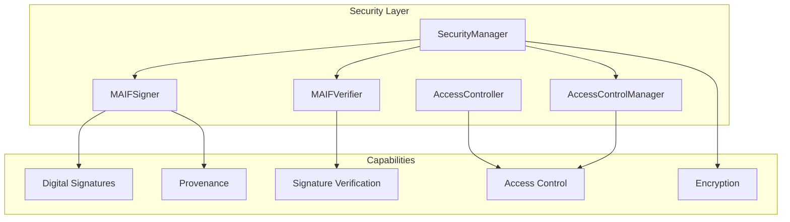

# Security API

MAIF provides comprehensive security features for protecting AI agent data, including digital signatures, encryption, access control, and provenance tracking.

## Overview



## Quick Start

```python
from maif.security import SecurityManager, MAIFSigner, MAIFVerifier, AccessController

# Create security manager
security = SecurityManager(use_kms=False, require_encryption=False)

# Sign data
signature = security.create_signature(b"Important data")

# Encrypt data
encrypted = security.encrypt_data(b"Sensitive information")
decrypted = security.decrypt_data(encrypted)

# Access control
security.access_control.grant_permission("user-1", "block-123", "read")
if security.access_control.check_access("user-1", "block-123", "read"):
    print("Access granted")
```

## SecurityManager

The main security manager class that coordinates signing, encryption, and access control.

### Constructor

```python
class SecurityManager:
    def __init__(
        self,
        use_kms: bool = True,
        kms_key_id: Optional[str] = None,
        region_name: str = "us-east-1",
        require_encryption: bool = True
    ):
        """
        Initialize SecurityManager.

        Args:
            use_kms: Enable AWS KMS for encryption (requires boto3)
            kms_key_id: KMS key ID for encryption operations
            region_name: AWS region for KMS
            require_encryption: Raise error if encryption fails
        """
```

### Methods

#### create_signature

Create a digital signature for data.

```python
def create_signature(self, data: bytes) -> str:
    """
    Create digital signature.

    Args:
        data: Data to sign

    Returns:
        Base64-encoded signature
    """
```

#### verify_signature

Verify a digital signature.

```python
def verify_signature(
    self,
    data: bytes,
    signature: str,
    public_key_pem: str
) -> bool:
    """
    Verify digital signature.

    Args:
        data: Original data
        signature: Base64-encoded signature
        public_key_pem: PEM-encoded public key

    Returns:
        True if signature is valid
    """
```

#### encrypt_data

Encrypt data using FIPS-compliant AES-256-GCM.

```python
def encrypt_data(self, data: bytes) -> bytes:
    """
    Encrypt data.

    Args:
        data: Data to encrypt

    Returns:
        Encrypted data with metadata header

    Raises:
        ValueError: If data is empty
        RuntimeError: If encryption fails and require_encryption is True
    """
```

#### decrypt_data

Decrypt data that was encrypted with `encrypt_data`.

```python
def decrypt_data(self, data: bytes) -> bytes:
    """
    Decrypt data.

    Args:
        data: Encrypted data with metadata header

    Returns:
        Decrypted data

    Raises:
        ValueError: If data is empty or invalid
        RuntimeError: If decryption fails
    """
```

#### validate_integrity

Validate data integrity using SHA-256 hash.

```python
def validate_integrity(self, data: bytes, expected_hash: str) -> bool:
    """
    Validate data integrity.

    Args:
        data: Data to validate
        expected_hash: Expected SHA-256 hash

    Returns:
        True if hash matches
    """
```

#### log_security_event

Log a security event for auditing.

```python
def log_security_event(self, event_type: str, details: dict):
    """
    Log security event.

    Args:
        event_type: Type of event (e.g., "encrypt_request", "access_denied")
        details: Event details dictionary
    """
```

#### get_security_status

Get current security status.

```python
def get_security_status(self) -> dict:
    """
    Get security status.

    Returns:
        Dictionary with:
            - security_enabled: bool
            - events_logged: int
            - last_event: dict or None
    """
```

### Example

```python
from maif.security import SecurityManager

# Create security manager for local encryption
security = SecurityManager(use_kms=False, require_encryption=True)

# Encrypt sensitive data
original = b"User SSN: 123-45-6789"
encrypted = security.encrypt_data(original)

print(f"Original size: {len(original)}")
print(f"Encrypted size: {len(encrypted)}")

# Decrypt
decrypted = security.decrypt_data(encrypted)
assert decrypted == original

# Check status
status = security.get_security_status()
print(f"Security events: {status['events_logged']}")
```

## MAIFSigner

Handles digital signatures and provenance chain management.

### Constructor

```python
class MAIFSigner:
    def __init__(
        self,
        private_key_path: Optional[str] = None,
        agent_id: Optional[str] = None
    ):
        """
        Initialize signer.

        Args:
            private_key_path: Path to PEM private key file
            agent_id: Agent identifier (auto-generated if not provided)
        """
```

### Methods

#### sign_data

Sign data and return base64-encoded signature.

```python
def sign_data(self, data: bytes) -> str:
    """
    Sign data.

    Args:
        data: Data to sign

    Returns:
        Base64-encoded RSA-PSS signature

    Raises:
        ValueError: If data is empty
    """
```

#### get_public_key_pem

Get the public key in PEM format.

```python
def get_public_key_pem(self) -> bytes:
    """
    Get public key.

    Returns:
        PEM-encoded public key bytes
    """
```

#### add_provenance_entry

Add an entry to the provenance chain.

```python
def add_provenance_entry(
    self,
    action: str,
    block_hash: str,
    metadata: Optional[Dict] = None
) -> ProvenanceEntry:
    """
    Add provenance entry.

    Args:
        action: Action performed (e.g., "create", "update", "delete")
        block_hash: Hash of the affected block
        metadata: Optional additional metadata

    Returns:
        The created ProvenanceEntry
    """
```

#### get_provenance_chain

Get the complete provenance chain.

```python
def get_provenance_chain(self) -> List[Dict]:
    """
    Get provenance chain.

    Returns:
        List of provenance entries as dictionaries
    """
```

#### sign_maif_manifest

Sign a MAIF manifest.

```python
def sign_maif_manifest(self, manifest: Dict) -> Dict:
    """
    Sign a manifest.

    Args:
        manifest: Manifest dictionary

    Returns:
        Signed manifest with signature, public_key, and signature_metadata
    """
```

### Example

```python
from maif.security import MAIFSigner

# Create signer
signer = MAIFSigner(agent_id="my-agent")

# Sign data
data = b"Important document content"
signature = signer.sign_data(data)
print(f"Signature: {signature[:50]}...")

# Get public key for verification
public_key = signer.get_public_key_pem()
print(f"Public key length: {len(public_key)} bytes")

# Add provenance entry
entry = signer.add_provenance_entry(
    action="create",
    block_hash="abc123...",
    metadata={"reason": "Initial creation"}
)

# Get provenance chain
chain = signer.get_provenance_chain()
print(f"Provenance chain has {len(chain)} entries")
```

## MAIFVerifier

Handles verification of signatures and provenance chains.

### Methods

#### verify_signature

Verify a signature against data.

```python
def verify_signature(
    self,
    data: bytes,
    signature: str,
    public_key_pem: str
) -> bool:
    """
    Verify signature.

    Args:
        data: Original data
        signature: Base64-encoded signature
        public_key_pem: PEM-encoded public key

    Returns:
        True if signature is valid
    """
```

#### verify_maif_signature

Verify a signed MAIF manifest.

```python
def verify_maif_signature(self, signed_manifest: Dict) -> bool:
    """
    Verify manifest signature.

    Args:
        signed_manifest: Manifest with signature and public_key

    Returns:
        True if signature is valid
    """
```

#### verify_maif_manifest

Verify a MAIF manifest structure and signature.

```python
def verify_maif_manifest(self, manifest: Dict) -> Tuple[bool, List[str]]:
    """
    Verify manifest.

    Args:
        manifest: Manifest dictionary

    Returns:
        Tuple of (is_valid, list_of_errors)
    """
```

#### verify_provenance_chain

Verify the integrity of a provenance chain.

```python
def verify_provenance_chain(
    self,
    provenance_data: Dict
) -> Tuple[bool, List[str]]:
    """
    Verify provenance chain.

    Args:
        provenance_data: Provenance chain data

    Returns:
        Tuple of (is_valid, list_of_errors)
    """
```

### Example

```python
from maif.security import MAIFSigner, MAIFVerifier

# Create signer and sign manifest
signer = MAIFSigner(agent_id="agent-1")
manifest = {"blocks": [], "version": "1.0.0"}
signed = signer.sign_maif_manifest(manifest)

# Verify with verifier
verifier = MAIFVerifier()

# Verify signature
is_valid = verifier.verify_maif_signature(signed)
print(f"Signature valid: {is_valid}")

# Verify manifest structure
is_valid, errors = verifier.verify_maif_manifest(signed)
if not is_valid:
    print(f"Errors: {errors}")

# Verify provenance chain
provenance = {"chain": signer.get_provenance_chain()}
is_valid, errors = verifier.verify_provenance_chain(provenance)
print(f"Provenance valid: {is_valid}")
```

## ProvenanceEntry

Dataclass representing a provenance chain entry.

```python
@dataclass
class ProvenanceEntry:
    timestamp: float
    agent_id: str
    action: str
    block_hash: str
    signature: str = ""
    previous_hash: Optional[str] = None
    entry_hash: Optional[str] = None
    agent_did: Optional[str] = None
    metadata: Dict = field(default_factory=dict)
    verification_status: str = "unverified"
```

### Methods

#### calculate_entry_hash

Calculate the cryptographic hash of the entry.

```python
def calculate_entry_hash(self) -> str:
    """Calculate SHA-256 hash of entry."""
```

#### verify

Verify entry integrity and signature.

```python
def verify(self, public_key_pem: Optional[str] = None) -> bool:
    """
    Verify entry.

    Args:
        public_key_pem: Public key for signature verification

    Returns:
        True if valid
    """
```

#### to_dict

Convert to dictionary.

```python
def to_dict(self) -> Dict:
    """Convert to dictionary representation."""
```

## Security Best Practices

### 1. Key Management

```python
# Use environment variables for key paths
import os
from maif.security import MAIFSigner

key_path = os.environ.get("MAIF_PRIVATE_KEY_PATH")
signer = MAIFSigner(private_key_path=key_path)
```

### 2. Encrypt Sensitive Data

```python
from maif.security import SecurityManager

security = SecurityManager(require_encryption=True)

# Always encrypt PII
pii_data = b"SSN: 123-45-6789"
encrypted = security.encrypt_data(pii_data)
```

### 3. Verify Before Trust

```python
from maif.security import MAIFVerifier

verifier = MAIFVerifier()

# Always verify manifests from external sources
is_valid, errors = verifier.verify_maif_manifest(external_manifest)
if not is_valid:
    raise SecurityError(f"Invalid manifest: {errors}")
```

### 4. Log Security Events

```python
security.log_security_event("access_attempt", {
    "user": "user-123",
    "resource": "sensitive-data",
    "result": "denied"
})
```

## Related Documentation

- [Access Control](/api/security/access-control) - Fine-grained access control
- [Privacy Engine](/api/privacy/engine) - Privacy features
