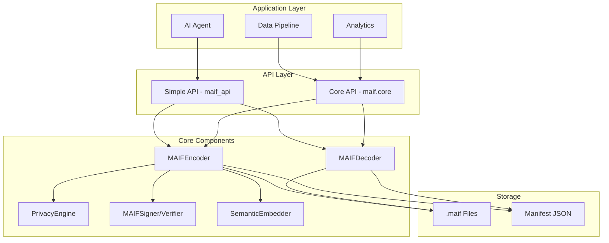
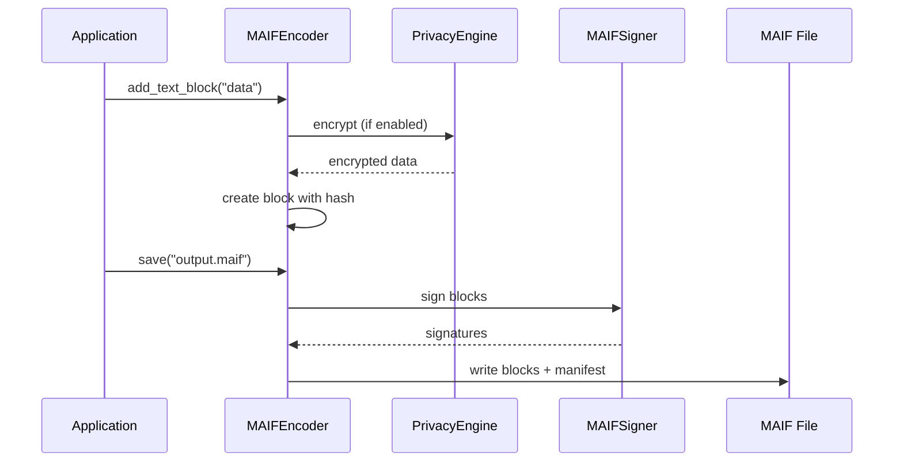
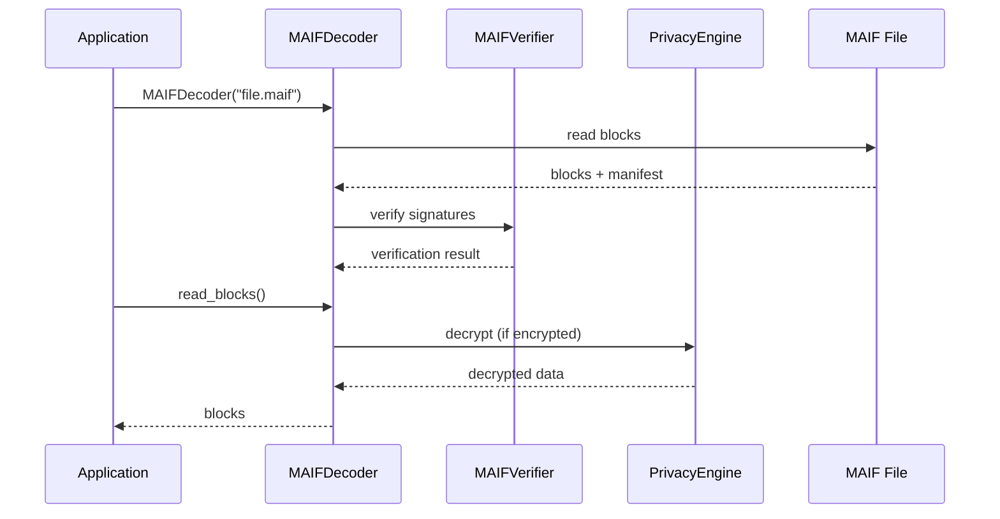
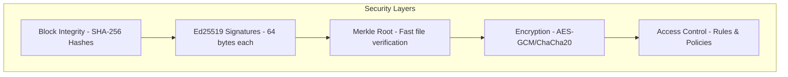
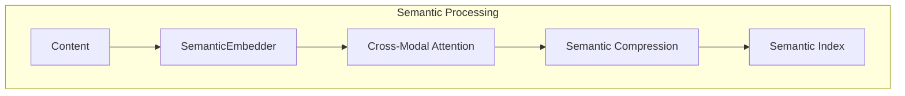

# System Architecture

::: danger DEPRECATED
This page is deprecated. For the latest and most accurate documentation, please visit **[DeepWiki - Repository Architecture](https://deepwiki.com/vineethsai/maif#repository-architecture)**.

DeepWiki documentation is auto-generated from the codebase and always up-to-date.
:::

MAIF's architecture is designed for AI applications with built-in security, privacy, and semantic understanding. This guide explains the system's design and components.

## High-Level Architecture



## Component Overview

### API Layers

MAIF provides two API levels:

**1. Simple API (`maif_api.py`)**
- Easy-to-use `MAIF` class
- High-level operations
- Convenience functions

```python
from maif_api import MAIF, create_maif, load_maif

maif = create_maif("my-agent")
maif.add_text("Hello!")
maif.save("output.maif")
```

**2. Core API (`maif.core`)**
- Low-level control
- Direct block manipulation
- Full feature access

```python
from maif.core import MAIFEncoder, MAIFDecoder

encoder = MAIFEncoder("output.maif", agent_id="my-agent")
encoder.add_text_block("Hello!", metadata={"lang": "en"})
encoder.finalize()
```

### Core Components

| Component | Module | Purpose |
|-----------|--------|---------|
| `MAIFEncoder` | `maif.core` | Create and write MAIF files |
| `MAIFDecoder` | `maif.core` | Read and parse MAIF files |
| `PrivacyEngine` | `maif.privacy` | Encryption, anonymization, access control |
| `MAIFSigner` | `maif.security` | Digital signatures |
| `MAIFVerifier` | `maif.security` | Signature verification |
| `SemanticEmbedder` | `maif.semantic` | Generate embeddings |

## Block Architecture

MAIF files consist of blocks - the fundamental unit of data storage:

```
┌──────────────────────────────────────────────────┐
│                  MAIF File                        │
├──────────────────────────────────────────────────┤
│  ┌────────────────────────────────────────────┐  │
│  │              Block Header                   │  │
│  │  - Block ID (UUID)                         │  │
│  │  - Block Type (TEXT, IMAGE, etc.)          │  │
│  │  - Size                                     │  │
│  │  - Hash (SHA-256)                          │  │
│  └────────────────────────────────────────────┘  │
│  ┌────────────────────────────────────────────┐  │
│  │              Block Data                     │  │
│  │  - Content (text, binary, vectors)         │  │
│  │  - Compressed (optional)                   │  │
│  │  - Encrypted (optional)                    │  │
│  └────────────────────────────────────────────┘  │
│  ┌────────────────────────────────────────────┐  │
│  │             Block Metadata                  │  │
│  │  - Title, description                      │  │
│  │  - Privacy level                           │  │
│  │  - Custom metadata (JSON)                  │  │
│  └────────────────────────────────────────────┘  │
├──────────────────────────────────────────────────┤
│  ... more blocks ...                             │
├──────────────────────────────────────────────────┤
│                   Manifest                        │
│  - Block index                                   │
│  - Signatures                                    │
│  - File metadata                                 │
└──────────────────────────────────────────────────┘
```

### Block Types

```python
from maif.block_types import BlockType

# Available block types
BlockType.TEXT_DATA      # Text content
BlockType.IMAGE_DATA     # Image binary
BlockType.VIDEO_DATA     # Video binary
BlockType.AUDIO_DATA     # Audio binary
BlockType.EMBEDDINGS     # Vector embeddings
BlockType.METADATA       # Metadata blocks
BlockType.BINARY         # Generic binary
```

## Data Flow

### Write Flow



### Read Flow



## Security Architecture



### Security Flow

```python
from maif.core import MAIFEncoder
from maif.privacy import PrivacyEngine, PrivacyLevel, EncryptionMode
from maif.security import MAIFSigner

# Create components
privacy = PrivacyEngine()
signer = MAIFSigner(agent_id="secure-agent")

# Create encoder with security
encoder = MAIFEncoder(
    agent_id="secure-agent",
    enable_privacy=True,
    privacy_engine=privacy
)

# Add encrypted block
encoder.add_text_block(
    "Sensitive data",
    privacy_level=PrivacyLevel.CONFIDENTIAL,
    encryption_mode=EncryptionMode.AES_GCM
)

# Save with signatures
encoder.finalize()
```

## Semantic Architecture

MAIF includes semantic understanding capabilities:



### Semantic Components

```python
from maif.semantic import (
    SemanticEmbedder,
    CrossModalAttention,
    HierarchicalSemanticCompression,
    KnowledgeGraphBuilder
)

# Generate embeddings
embedder = SemanticEmbedder()
embedding = embedder.embed("Text content")

# Cross-modal attention for multimodal content
acam = CrossModalAttention()

# Semantic compression
hsc = HierarchicalSemanticCompression()

# Knowledge graph building
kg = KnowledgeGraphBuilder()
```

## Storage Format

### Secure MAIF File Structure

MAIF files are **self-contained** — no external manifest needed. A `.maif` file contains:

1. **File Header** (252 bytes)
   - Magic bytes (`MAIF`)
   - Version info
   - Ed25519 public key (32 bytes)
   - Merkle root hash (32 bytes)
   - File-level signature (64 bytes)

2. **Signed Blocks** (variable size)
   - Block header (180 bytes each)
   - Block data
   - Ed25519 signature (64 bytes)
   - Link to previous block hash

3. **Provenance Section**
   - Complete operation history
   - Agent IDs and timestamps
   - Signed provenance entries

4. **Security Section**
   - Verification metadata
   - Algorithm identifiers

### Block Header Structure

Each block header contains:
```
┌─────────────────────────────────────┐
│  Block ID (16 bytes UUID)           │
│  Block Type (4 chars)               │
│  Data Size + Flags                  │
│  SHA-256 Hash (32 bytes)            │
│  Previous Block Hash (32 bytes)     │
│  Ed25519 Signature (64 bytes)       │
│  Timestamp                          │
└─────────────────────────────────────┘
```

## Performance Optimization

### Memory-Mapped I/O

```python
from maif.core import MAIFEncoder

# Enable memory mapping for large files
encoder = MAIFEncoder(
    agent_id="perf-agent",
    enable_mmap=True
)
```

### Compression

```python
from maif.compression_manager import CompressionManager

# Enable compression
compression = CompressionManager()
compressed_data = compression.compress(data)
```

### Streaming

```python
from maif.streaming import MAIFStreamReader, MAIFStreamWriter

# Stream large files
with MAIFStreamWriter("large.maif") as writer:
    for chunk in data_chunks:
        writer.write_chunk(chunk)

with MAIFStreamReader("large.maif") as reader:
    for block in reader.read_blocks():
        process(block)
```

## Integration Patterns

### With AI Frameworks

```python
# LangChain/LangGraph integration
from maif.core import MAIFEncoder, MAIFDecoder

# Store agent memory
encoder = MAIFEncoder("agent_memory.maif", agent_id="langchain-agent")
encoder.add_text_block(conversation_history)
encoder.add_embeddings_block(context_embeddings)
encoder.finalize()

# Load for retrieval
decoder = MAIFDecoder("agent_memory.maif")
for block in decoder.read_blocks():
    # Use in RAG pipeline
    pass
```

### With Vector Databases

```python
# Export to vector DB
from maif.core import MAIFDecoder

decoder = MAIFDecoder("embeddings.maif")
for block in decoder.get_blocks_by_type("EMBD"):
    # Load into ChromaDB, Pinecone, etc.
    vector_db.add(block.data, block.metadata)
```

## Module Organization

```
maif/
├── __init__.py          # Main exports
├── core.py              # MAIFEncoder, MAIFDecoder
├── security.py          # MAIFSigner, MAIFVerifier
├── privacy.py           # PrivacyEngine, AccessControl
├── semantic.py          # SemanticEmbedder, etc.
├── streaming.py         # Stream reader/writer
├── compression.py       # Compression utilities
├── block_types.py       # Block type definitions
├── block_storage.py     # Block storage operations
├── validation.py        # Validation utilities
└── ...
```

## Best Practices

### 1. Use Simple API for Common Tasks

```python
# Prefer simple API when possible
from maif_api import create_maif

maif = create_maif("agent")
maif.add_text("content")
maif.save("output.maif")
```

### 2. Use Core API for Complex Operations

```python
# Core API for fine-grained control
from maif.core import MAIFEncoder

encoder = MAIFEncoder("output.maif", agent_id="agent")
encoder.add_text_block("content", metadata={...})
encoder.add_embeddings_block(vectors, metadata={...})
encoder.finalize()
```

### 3. Enable Privacy for Sensitive Data

```python
# Always enable privacy for sensitive content
maif = create_maif("agent", enable_privacy=True)
```

### 4. Verify Integrity on Load

```python
# Always verify after loading
from maif_api import load_maif

maif = load_maif("data.maif")
if not maif.verify_integrity():
    raise ValueError("File corrupted")
```

## Next Steps

- **[Block Structure →](/guide/blocks)** - Deep dive into blocks
- **[Security Model →](/guide/security-model)** - Security details
- **[Privacy Framework →](/guide/privacy)** - Privacy features
- **[API Reference →](/api/)** - Complete API documentation
