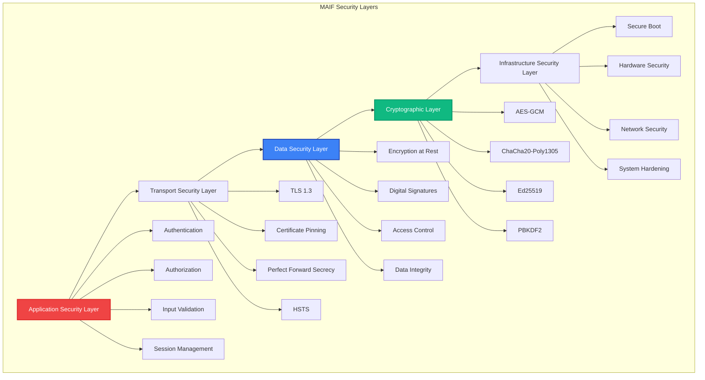

# Security Model

MAIF implements a comprehensive security model based on defense-in-depth principles, zero-trust architecture, and cryptographic best practices. This guide explains how security is implemented at every layer of the system.

## Security Architecture Overview

MAIF's security model operates on multiple layers, each providing specific protections:



## Cryptographic Foundation

### Encryption Algorithms

MAIF supports multiple modern, authenticated encryption algorithms. You can configure the desired security level and algorithm when creating a client.

```python
from maif_sdk import create_client
from maif.security import SecurityLevel, EncryptionAlgorithm

# Configure a client with a top-secret security level, using AES-GCM encryption
# with a high number of key derivation rounds for added security.
client = create_client(
    "secure-agent",
    security_level=SecurityLevel.TOP_SECRET,
    encryption_algorithm=EncryptionAlgorithm.AES_GCM,
    key_derivation_rounds=100000 # Increases resistance to brute-force attacks.
)
```

**Supported Algorithms:**
- **AES-GCM**: Fast, hardware-accelerated, authenticated encryption
- **ChaCha20-Poly1305**: Software-optimized, constant-time implementation
- **XChaCha20-Poly1305**: Extended nonce version for high-volume scenarios

### Digital Signatures

All data blocks can be digitally signed to ensure their integrity and authenticity. You can enable automatic signing at the client level or apply signatures manually.

```python
from maif_sdk import create_client, create_artifact

# Configure a client to automatically sign all data blocks using the Ed25519 algorithm.
client = create_client(
    "signed-agent",
    enable_signing=True,
    signature_algorithm="Ed25519"
)

# You can also sign individual blocks manually for more granular control.
artifact = create_artifact("manual-signing-demo", client=client)
artifact.add_text(
    "Important document that requires a signature.",
    sign=True,
    signature_algorithm="Ed25519"
)
```

**Supported Signature Algorithms:**
- **Ed25519**: Fast, secure, small signatures
- **RSA-PSS**: Industry standard, configurable key sizes
- **ECDSA**: Elliptic curve signatures

### Key Management

MAIF implements secure key management with options for derivation, storage, and rotation, including support for Hardware Security Modules (HSMs).

```python
from maif_sdk import create_client
from maif.security import KeyManager, KeyStorage

# Configure a key manager to use the Argon2 algorithm for key derivation,
# store keys in an HSM, and automatically rotate them every 30 days.
key_manager = KeyManager(
    derivation_algorithm="Argon2",
    derivation_rounds=100000,
    storage_backend=KeyStorage.HSM, # For enterprise-grade security.
    rotation_policy="30_days"
)

# Create a client that uses this robust key management configuration.
client = create_client(
    "enterprise-agent",
    key_manager=key_manager
)
```

## Access Control

MAIF implements fine-grained access control with support for multiple models, including Role-Based and Attribute-Based Access Control.

### Role-Based Access Control (RBAC)

Define roles with specific permissions and assign users to those roles to manage access to artifacts.

```python
from maif.security import AccessController, Role, Permission
from maif_sdk import create_artifact

# Assume an artifact is already created.
artifact = create_artifact("rbac-demo")

# Define roles with a specific set of permissions.
admin_role = Role("admin", [
    Permission.READ,
    Permission.WRITE,
    Permission.DELETE,
    Permission.ADMIN # Permission to manage access control itself.
])
user_role = Role("user", [
    Permission.READ,
    Permission.WRITE
])

# Configure an access controller with the RBAC model and the defined roles.
access_controller = AccessController(
    model="RBAC",
    roles=[admin_role, user_role]
)

# Apply the access control policy to the artifact, assigning users to roles.
artifact.set_access_control(
    controller=access_controller,
    assignments={
        "admin": ["alice", "bob"],
        "user": ["charlie", "diana"]
    }
)
```

### Attribute-Based Access Control (ABAC)

Define complex, attribute-based rules to govern access based on user, resource, and environmental conditions.

```python
from maif.security import AccessController

# This ABAC policy allows access only if the user is in the finance department,
# the resource is confidential, and the access time is within business hours.
abac_policy = {
    "rules": [
        {
            "effect": "allow",
            "conditions": {
                "user.department": "finance",
                "resource.classification": "confidential",
                "environment.time": "business_hours"
            }
        }
    ]
}

# Configure the access controller to use the ABAC model with the defined policy.
access_controller = AccessController(
    model="ABAC",
    policy=abac_policy
)
```

### Block-Level Permissions

Apply fine-grained permissions directly to individual data blocks within an artifact for maximum control.

```python
from maif_sdk import create_artifact

# Mock artifact and block_id for demonstration.
artifact = create_artifact("block-level-permission-demo")
block_id = artifact.add_text("A highly sensitive data block.")

# Set specific read and write permissions for a single block.
# Access can be controlled by user, role, and dynamic conditions.
artifact.set_block_permissions(block_id, {
    "read": {
        "users": ["alice", "bob"],
        "roles": ["analyst"],
        "conditions": {
            "time_range": "09:00-17:00", # Condition: only during business hours
            "location": "office_network" # Condition: only from the office network
        }
    },
    "write": {
        "users": ["admin"],
        "require_mfa": True # Condition: require multi-factor authentication for writes.
    }
})
```

## Audit and Compliance

### Comprehensive Audit Logging

MAIF maintains detailed, immutable audit logs for all operations, providing a complete history for security analysis and compliance.

```python
from maif_sdk import create_client, create_artifact

# Configure a client to enable detailed, immutable audit logging.
client = create_client(
    "audited-agent",
    enable_audit_trail=True,
    audit_level="DETAILED", # Log all operation details.
    audit_storage="immutable" # Use tamper-proof storage for logs.
)
artifact = create_artifact("audited-artifact", client=client)

# Query the audit logs for a specific time range and filter by operation type.
audit_logs = artifact.get_audit_trail(
    start_time="2024-01-01T00:00:00Z",
    end_time="2024-01-31T23:59:59Z",
    filters={"operation": "WRITE"}
)

# Process and review the audit logs.
for log_entry in audit_logs:
    print(f"[{log_entry.timestamp}] User '{log_entry.user}' performed '{log_entry.operation}' on block '{log_entry.block_id}'")
```

### Audit Log Structure

```python
class AuditLogEntry:
    timestamp: datetime
    user_id: str
    session_id: str
    operation: str
    resource_id: str
    resource_type: str
    result: str  # SUCCESS, FAILURE, DENIED
    ip_address: str
    user_agent: str
    additional_context: dict
    signature: bytes  # Cryptographic signature
```

### Compliance Features

MAIF supports multiple compliance frameworks:

```python
# Configure for GDPR compliance
client = create_client(
    "gdpr-compliant-agent",
    compliance_framework="GDPR",
    data_retention_policy="7_years",
    right_to_be_forgotten=True,
    consent_management=True
)

# HIPAA compliance
client = create_client(
    "hipaa-compliant-agent",
    compliance_framework="HIPAA",
    encryption_required=True,
    audit_level="MAXIMUM",
    access_logging=True
)
```

## Threat Protection

### Input Validation and Sanitization

```python
from maif.security import InputValidator

# Configure input validation
validator = InputValidator(
    max_text_length=10000,
    allowed_file_types=["txt", "pdf", "docx"],
    scan_for_malware=True,
    detect_injection_attacks=True
)

# Validate input
validated_text = validator.validate_text(user_input)
validated_file = validator.validate_file(uploaded_file)
```

### Injection Attack Prevention

```python
# SQL injection prevention (for structured data)
safe_query = artifact.search_structured_data(
    query=user_query,
    sanitize=True,
    escape_special_chars=True
)

# Code injection prevention
safe_code = validator.sanitize_code(
    user_code,
    allowed_functions=["print", "len", "str"],
    block_imports=True
)
```

### Rate Limiting and DoS Protection

```python
# Configure rate limiting
client = create_client(
    "protected-agent",
    rate_limit_per_minute=100,
    rate_limit_per_hour=1000,
    ddos_protection=True,
    connection_throttling=True
)
```

## Security Monitoring

### Real-time Security Monitoring

```python
from maif.security import SecurityMonitor

# Configure security monitoring
monitor = SecurityMonitor(
    enable_anomaly_detection=True,
    alert_on_suspicious_activity=True,
    integration="SIEM"
)

# Set up alerts
monitor.add_alert_rule({
    "condition": "failed_login_attempts > 5",
    "action": "block_user",
    "notification": "security_team@company.com"
})

monitor.add_alert_rule({
    "condition": "unusual_data_access_pattern",
    "action": "require_mfa",
    "notification": "admin@company.com"
})
```

### Security Metrics

```python
# Get security metrics
security_metrics = client.get_security_metrics()

print(f"Failed authentication attempts: {security_metrics.failed_auth_attempts}")
print(f"Blocked IPs: {security_metrics.blocked_ips}")
print(f"Suspicious activities detected: {security_metrics.suspicious_activities}")
print(f"Data integrity violations: {security_metrics.integrity_violations}")
```

## Incident Response

### Automated Response

```python
from maif.security import IncidentResponse

# Configure incident response
incident_response = IncidentResponse(
    auto_block_suspicious_users=True,
    auto_rotate_compromised_keys=True,
    emergency_contacts=["security@company.com"],
    escalation_policy="immediate"
)

# Manual incident handling
incident = incident_response.create_incident(
    type="data_breach",
    severity="high",
    description="Unauthorized access detected"
)

# Forensic data collection
forensic_data = incident_response.collect_forensic_data(
    incident_id=incident.id,
    time_range="last_24_hours"
)
```

### Security Incident Types

1. **Unauthorized Access**: Failed authentication, privilege escalation
2. **Data Breach**: Unauthorized data access or exfiltration
3. **Integrity Violation**: Data tampering, signature verification failure
4. **Availability Attack**: DoS, resource exhaustion
5. **Malware Detection**: Virus, trojan, or suspicious code

## Security Best Practices

### 1. Defense in Depth

```python
# Implement multiple security layers
client = create_client(
    "hardened-agent",
    # Authentication
    require_mfa=True,
    session_timeout=3600,
    
    # Authorization
    access_control="RBAC",
    principle_of_least_privilege=True,
    
    # Encryption
    encryption_algorithm="XChaCha20-Poly1305",
    key_rotation_interval="30_days",
    
    # Monitoring
    enable_audit_trail=True,
    anomaly_detection=True,
    
    # Network security
    ip_whitelist=["10.0.0.0/8"],
    require_tls=True
)
```

### 2. Zero Trust Architecture

```python
# Never trust, always verify
artifact.add_text(
    sensitive_data,
    encrypt=True,              # Encrypt everything
    sign=True,                 # Sign everything
    verify_on_read=True,       # Verify on every access
    require_fresh_auth=True    # Re-authenticate for sensitive operations
)
```

### 3. Secure Development Practices

```python
# Secure configuration
client = create_client(
    "secure-dev-agent",
    # Disable debug features in production
    debug_mode=False,
    verbose_errors=False,
    
    # Secure defaults
    default_encryption=True,
    default_signing=True,
    strict_validation=True,
    
    # Security headers
    security_headers={
        "X-Content-Type-Options": "nosniff",
        "X-Frame-Options": "DENY",
        "X-XSS-Protection": "1; mode=block"
    }
)
```

## Enterprise Security Features

### Hardware Security Module (HSM) Integration

```python
from maif.security import HSMProvider

# Configure HSM
hsm = HSMProvider(
    provider="local",  # AWS CloudHSM removed
    cluster_id="cluster-12345",
    partition="production"
)

client = create_client(
    "hsm-secured-agent",
    key_storage=hsm,
    require_hsm_signatures=True
)
```

### Multi-Factor Authentication

```python
from maif.security import MFAProvider

# Configure MFA
mfa = MFAProvider(
    methods=["TOTP", "SMS", "Hardware_Token"],
    backup_codes=True,
    remember_device=False
)

client = create_client(
    "mfa-protected-agent",
    mfa_provider=mfa,
    require_mfa_for_sensitive_ops=True
)
```

### Certificate Management

```python
from maif.security import CertificateManager

# Configure certificate management
cert_manager = CertificateManager(
    ca_provider="Internal_CA",
    auto_renewal=True,
    certificate_transparency=True,
    ocsp_stapling=True
)

client = create_client(
    "cert-managed-agent",
    certificate_manager=cert_manager,
    require_client_certificates=True
)
```

## Security Testing

### Penetration Testing Support

```python
# Enable security testing mode
client = create_client(
    "pentest-agent",
    security_testing_mode=True,
    log_all_attempts=True,
    generate_security_report=True
)

# Run security tests
security_report = client.run_security_tests([
    "authentication_bypass",
    "authorization_escalation",
    "injection_attacks",
    "encryption_weaknesses"
])
```

### Vulnerability Scanning

```python
# Scan for vulnerabilities
vulnerabilities = client.scan_vulnerabilities([
    "outdated_dependencies",
    "weak_configurations",
    "exposed_secrets",
    "insecure_permissions"
])

for vuln in vulnerabilities:
    print(f"Severity: {vuln.severity}, Type: {vuln.type}, Fix: {vuln.remediation}")
```

## Compliance Certifications

MAIF is designed to meet various compliance requirements:

- **SOC 2 Type II**: Security, availability, processing integrity
- **ISO 27001**: Information security management
- **FedRAMP**: US government cloud security
- **Common Criteria**: International security evaluation
- **FIPS 140-2**: Cryptographic module validation

```python
# Generate compliance report
compliance_report = client.generate_compliance_report(
    framework="SOC2",
    period="2024-Q1",
    include_evidence=True
)
```

## Security Configuration Examples

### High Security Configuration

```python
client = create_client(
    "maximum-security-agent",
    
    # Cryptography
    encryption_algorithm="XChaCha20-Poly1305",
    key_derivation="Argon2",
    key_derivation_rounds=200000,
    signature_algorithm="Ed25519",
    
    # Access Control
    access_control="ABAC",
    require_mfa=True,
    session_timeout=1800,
    max_failed_attempts=3,
    
    # Monitoring
    audit_level="MAXIMUM",
    anomaly_detection=True,
    real_time_alerts=True,
    
    # Network Security
    require_tls_1_3=True,
    certificate_pinning=True,
    ip_whitelist_only=True,
    
    # Data Protection
    data_loss_prevention=True,
    content_inspection=True,
    backup_encryption=True
)
```

### Compliance-Ready Configuration

```python
client = create_client(
    "compliance-ready-agent",
    
    # Regulatory compliance
    compliance_frameworks=["GDPR", "HIPAA", "SOX"],
    data_retention_policy="7_years",
    right_to_be_forgotten=True,
    
    # Audit requirements
    immutable_audit_logs=True,
    log_retention="10_years",
    third_party_attestation=True,
    
    # Privacy requirements
    privacy_by_design=True,
    consent_management=True,
    data_minimization=True
)
```

## Next Steps

- **[Privacy Framework →](/guide/privacy)** - Privacy features and compliance
- **[Performance →](/guide/performance)** - Security performance optimization
- **[API Security →](/api/security/)** - Security API reference
- **[Deployment Security →](/cookbook/security)** - Secure deployment patterns 