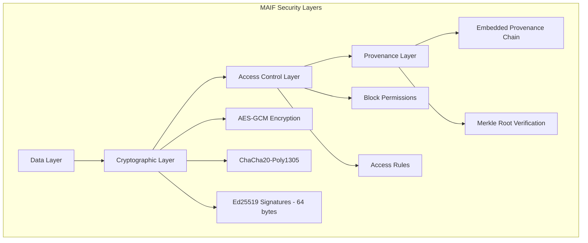

# Security Model

::: danger DEPRECATED
This page is deprecated. For the latest and most accurate documentation, please visit **[DeepWiki - Cryptographic Security](https://deepwiki.com/vineethsai/maif/2.2-cryptographic-security)**.

DeepWiki documentation is auto-generated from the codebase and always up-to-date.
:::

MAIF implements security at multiple levels: cryptographic signatures, encryption, access control, and provenance tracking. This guide explains the security features available in the current implementation.

## Security Architecture Overview

MAIF's security model provides:

- **Ed25519 Digital Signatures**: Fast, compact 64-byte signatures on every block
- **Encryption**: AES-GCM and ChaCha20-Poly1305 for data protection
- **Access Control**: Block-level permission management
- **Embedded Provenance**: Complete audit trail built into the file
- **Merkle Root Verification**: Fast whole-file integrity checking



## Digital Signatures

MAIF uses **Ed25519** for all digital signatures. Ed25519 provides:
- **Speed**: Signing and verification are nearly instant
- **Compact size**: Only 64 bytes per signature (vs 256+ bytes for RSA)
- **Strong security**: 128-bit security level, resistant to timing attacks

### MAIFSigner

The `MAIFSigner` class provides digital signature capabilities:

```python
from maif.security import MAIFSigner, MAIFVerifier

# Create a signer for your agent
signer = MAIFSigner(agent_id="my-agent")

# Sign data
data = b"Important content that needs verification"
signature = signer.sign_data(data)
print(f"Signature: {signature[:40]}...")

# Get public key for sharing
public_key = signer.get_public_key_pem()
print(f"Public key available for verification")
```

### MAIFVerifier

Verify signatures using the `MAIFVerifier`:

```python
from maif.security import MAIFVerifier

verifier = MAIFVerifier()

# Verify a signature
data = b"Important content that needs verification"
is_valid = verifier.verify_signature(data, signature, public_key)
print(f"Signature valid: {is_valid}")

# Verify MAIF manifest
manifest_valid = verifier.verify_maif_manifest(manifest_data, public_key)

# Verify provenance chain
chain_valid = verifier.verify_provenance_chain(provenance_entries)
```

### Provenance Tracking

Track all operations with cryptographic provenance:

```python
from maif.security import MAIFSigner

signer = MAIFSigner(agent_id="provenance-demo")

# Add provenance entries for operations
signer.add_provenance_entry("create", "block-001")
signer.add_provenance_entry("update", "block-001")
signer.add_provenance_entry("access", "block-001")

# Each entry is cryptographically linked to previous entries
```

## Encryption

### Privacy Engine Encryption

The `PrivacyEngine` handles encryption:

```python
from maif.privacy import PrivacyEngine, EncryptionMode

# Create privacy engine
privacy = PrivacyEngine()

# Encrypt data with AES-GCM (default)
encrypted = privacy.encrypt_data(
    b"Sensitive information",
    mode=EncryptionMode.AES_GCM
)

# Decrypt data
decrypted = privacy.decrypt_data(encrypted, mode=EncryptionMode.AES_GCM)

# ChaCha20-Poly1305 (alternative)
encrypted_chacha = privacy.encrypt_data(
    b"More sensitive data",
    mode=EncryptionMode.CHACHA20_POLY1305
)
```

### Encryption in MAIF Files

When creating MAIF files with encryption:

```python
from maif_api import create_maif

# Enable privacy for encryption support
maif = create_maif("secure-agent", enable_privacy=True)

# Add encrypted content
maif.add_text(
    "Confidential: This data is encrypted",
    title="Secret Document",
    encrypt=True
)

maif.save("encrypted.maif")
```

### Using MAIFEncoder with Privacy

```python
from maif.core import MAIFEncoder
from maif.privacy import PrivacyEngine, PrivacyLevel, EncryptionMode

# Create privacy engine
privacy_engine = PrivacyEngine()

# Create encoder with privacy
encoder = MAIFEncoder(
    "secure_artifact.maif",
    agent_id="secure-encoder",
    enable_privacy=True,
    privacy_engine=privacy_engine
)

# Add encrypted block
encoder.add_text_block(
    "Top secret information",
    privacy_level=PrivacyLevel.TOP_SECRET,
    encryption_mode=EncryptionMode.AES_GCM,
    metadata={"classification": "top_secret"}
)

encoder.finalize()
```

## Access Control

### AccessControlManager

Manage permissions at the block level:

```python
from maif.security import AccessControlManager

# Create access control manager
acm = AccessControlManager()

# Set block permissions
acm.set_block_permissions("block-001", {
    "read": ["user_a", "user_b"],
    "write": ["user_a"],
    "delete": ["admin"]
})

# Check if user has permission
can_read = acm.check_permission("user_b", "block-001", "read")
print(f"User B can read: {can_read}")

can_write = acm.check_permission("user_b", "block-001", "write")
print(f"User B can write: {can_write}")

# Get permissions manifest
manifest = acm.get_permissions_manifest()
```

### Access Rules in PrivacyEngine

```python
from maif.privacy import PrivacyEngine, AccessRule
from datetime import datetime, timedelta

privacy = PrivacyEngine()

# Add access rule
rule = AccessRule(
    subject="user_a",
    resource="block-001",
    permissions=["read", "write"],
    conditions={"department": "engineering"},
    expiry=datetime.now() + timedelta(days=30)
)
privacy.add_access_rule(rule)

# Check access
can_access = privacy.check_access("user_a", "block-001", "read")
```

## Privacy Levels

MAIF supports multiple privacy levels:

```python
from maif.privacy import PrivacyLevel

# Available privacy levels
PrivacyLevel.PUBLIC        # No restrictions
PrivacyLevel.INTERNAL      # Internal use only
PrivacyLevel.CONFIDENTIAL  # Confidential, requires authorization
PrivacyLevel.SECRET        # Secret, restricted access
PrivacyLevel.TOP_SECRET    # Highest classification
```

### Using Privacy Levels

```python
from maif.core import MAIFEncoder
from maif.privacy import PrivacyEngine, PrivacyLevel, EncryptionMode

privacy = PrivacyEngine()
encoder = MAIFEncoder(
    "classified.maif",
    agent_id="classified-demo",
    enable_privacy=True,
    privacy_engine=privacy
)

# Public content
encoder.add_text_block(
    "This is public information",
    privacy_level=PrivacyLevel.PUBLIC
)

# Confidential content with encryption
encoder.add_text_block(
    "This is confidential information",
    privacy_level=PrivacyLevel.CONFIDENTIAL,
    encryption_mode=EncryptionMode.AES_GCM
)

# Top secret content
encoder.add_text_block(
    "This is top secret information",
    privacy_level=PrivacyLevel.TOP_SECRET,
    encryption_mode=EncryptionMode.AES_GCM
)

encoder.finalize()
```

## Data Anonymization

The privacy engine can anonymize sensitive data:

```python
from maif.privacy import PrivacyEngine

privacy = PrivacyEngine()

# Anonymize text containing PII
text = "Contact John Smith at john@email.com or 555-123-4567"
anonymized = privacy.anonymize_data(text)
print(f"Anonymized: {anonymized}")
# Output might be: "Contact [NAME] at [EMAIL] or [PHONE]"
```

### Anonymization in MAIF Files

```python
from maif_api import create_maif

maif = create_maif("anon-agent", enable_privacy=True)

# Add with anonymization
maif.add_text(
    "Patient John Doe, SSN: 123-45-6789, visited on 2024-01-15",
    title="Medical Record",
    anonymize=True  # PII will be masked
)

maif.save("anonymized.maif")
```

## Integrity Verification

### Verify MAIF File Integrity

```python
from maif_api import load_maif

maif = load_maif("my_artifact.maif")

# Verify file hasn't been tampered with
if maif.verify_integrity():
    print(" File integrity verified")
else:
    print(" File may be corrupted or tampered")
```

### Hash Verification in Decoder

```python
from maif.core import MAIFDecoder

decoder = MAIFDecoder("artifact.maif")

# Each block has a hash for integrity
for block in decoder.read_blocks():
    # Block hash is automatically verified during read
    print(f"Block {block.block_id}: hash verified")
```

## Security Best Practices

### 1. Always Verify Integrity

```python
from maif_api import load_maif

def safe_load(filename):
    """Load MAIF file with integrity verification."""
    maif = load_maif(filename)
    if not maif.verify_integrity():
        raise ValueError(f"Integrity check failed for {filename}")
    return maif
```

### 2. Use Appropriate Privacy Levels

```python
from maif.privacy import PrivacyLevel

# Match privacy level to data sensitivity
def get_privacy_level(data_type):
    levels = {
        "public": PrivacyLevel.PUBLIC,
        "internal": PrivacyLevel.INTERNAL,
        "pii": PrivacyLevel.CONFIDENTIAL,
        "financial": PrivacyLevel.SECRET,
        "medical": PrivacyLevel.TOP_SECRET
    }
    return levels.get(data_type, PrivacyLevel.CONFIDENTIAL)
```

### 3. Encrypt Sensitive Data

```python
from maif_api import create_maif

def store_sensitive_data(content, title, sensitivity="confidential"):
    """Store sensitive data with appropriate encryption."""
    maif = create_maif("secure-agent", enable_privacy=True)
    
    # Always encrypt sensitive data
    maif.add_text(
        content,
        title=title,
        encrypt=True,
        anonymize=(sensitivity == "pii")
    )
    
    return maif
```

### 4. Track Provenance

```python
from maif.security import MAIFSigner

def create_auditable_artifact(agent_id, operations):
    """Create artifact with full provenance trail."""
    signer = MAIFSigner(agent_id=agent_id)
    
    for operation, target in operations:
        signer.add_provenance_entry(operation, target)
    
    return signer
```

## Available Security Components

| Component | Purpose | Import |
|-----------|---------|--------|
| `MAIFSigner` | Create digital signatures | `from maif.security import MAIFSigner` |
| `MAIFVerifier` | Verify signatures | `from maif.security import MAIFVerifier` |
| `AccessControlManager` | Block-level permissions | `from maif.security import AccessControlManager` |
| `PrivacyEngine` | Encryption and anonymization | `from maif.privacy import PrivacyEngine` |
| `PrivacyLevel` | Classification levels | `from maif.privacy import PrivacyLevel` |
| `EncryptionMode` | Encryption algorithms | `from maif.privacy import EncryptionMode` |
| `AccessRule` | Access control rules | `from maif.privacy import AccessRule` |

## Next Steps

- **[Privacy Framework →](/guide/privacy)** - Deep dive into privacy features
- **[API Security Reference →](/api/security/)** - Complete security API
- **[Examples →](/examples/)** - Security examples in practice
